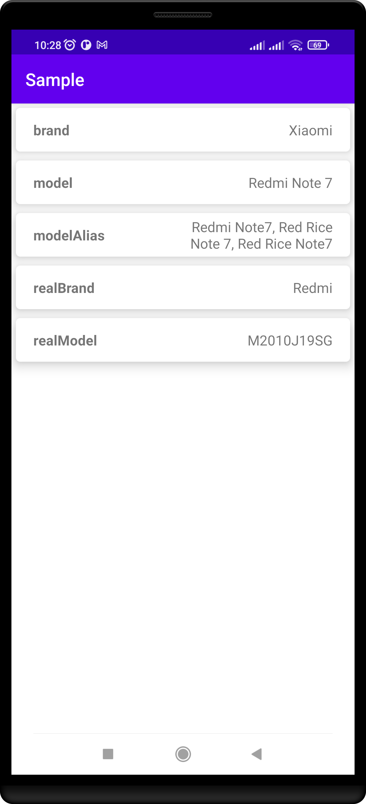
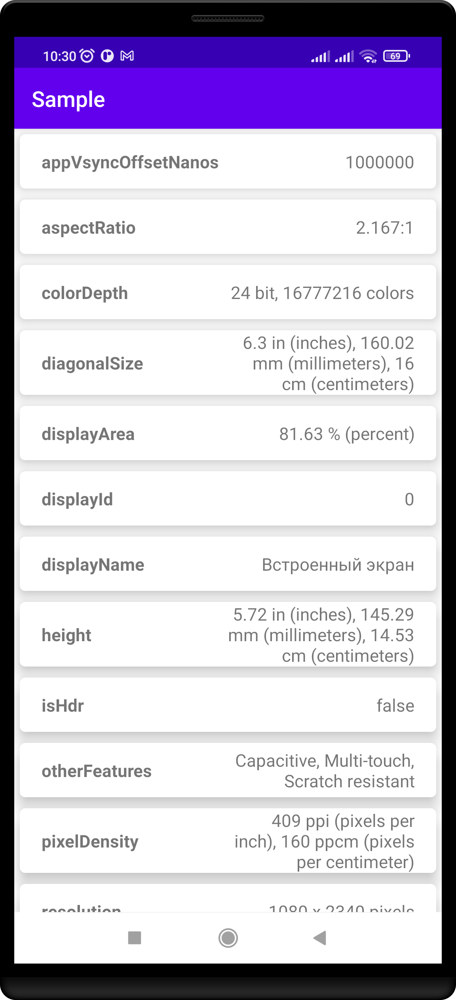

# AndroidInfoLib

This is a library that will help you get all the information from android

[](https://jitpack.io/#LiteSoftware/SectorProgressBar)

 

## How to use
1. Add this in your root `build.gradle` at the end of `repositories` in `allprojects` section:
```groovy
allprojects {
    repositories {
        maven { url 'https://jitpack.io' }
    }
}
```

2. Then add this dependency to your **module-level** `build.gradle` in `dependencies` section:
```groovy
implementation 'com.github.LiteSoftware:SectorProgressBar:$version'
```

3. Call any of the methods below to get information about your android
```kotlin
DeviceInformationFactory.getGeneralInformation()
DeviceInformationFactory.getRAMInformation(context)
DeviceInformationFactory.getOSInformation()
DeviceInformationFactory.getCPUInformation()
DeviceInformationFactory.getSIMCardInformation(context)
DeviceInformationFactory.getDisplayInformation(context)
DeviceInformationFactory.getNetworkTechnologiesInformation(context)
DeviceInformationFactory.getDesignInformation()
DeviceInformationFactory.getStorageInformation()
DeviceInformationFactory.getGPUInformation()
DeviceInformationFactory.getSensorsInformation()
DeviceInformationFactory.getRearCameraInformation()
DeviceInformationFactory.getFrontCameraInformation()
DeviceInformationFactory.getAudioInformation()
DeviceInformationFactory.getWirelessInformation()
DeviceInformationFactory.getUSBInformation()
DeviceInformationFactory.getBrowserInformation()
DeviceInformationFactory.getCodecsInformation()
DeviceInformationFactory.getBatteryInformation()
DeviceInformationFactory.getSARInformation()
```

---

## License

```
   Copyright 2022 Javavirys. All rights reserved.

   Licensed under the Apache License, Version 2.0 (the "License");
   you may not use this file except in compliance with the License.
   You may obtain a copy of the License at

       http://www.apache.org/licenses/LICENSE-2.0

   Unless required by applicable law or agreed to in writing, software
   distributed under the License is distributed on an "AS IS" BASIS,
   WITHOUT WARRANTIES OR CONDITIONS OF ANY KIND, either express or implied.
   See the License for the specific language governing permissions and
   limitations under the License.
```
